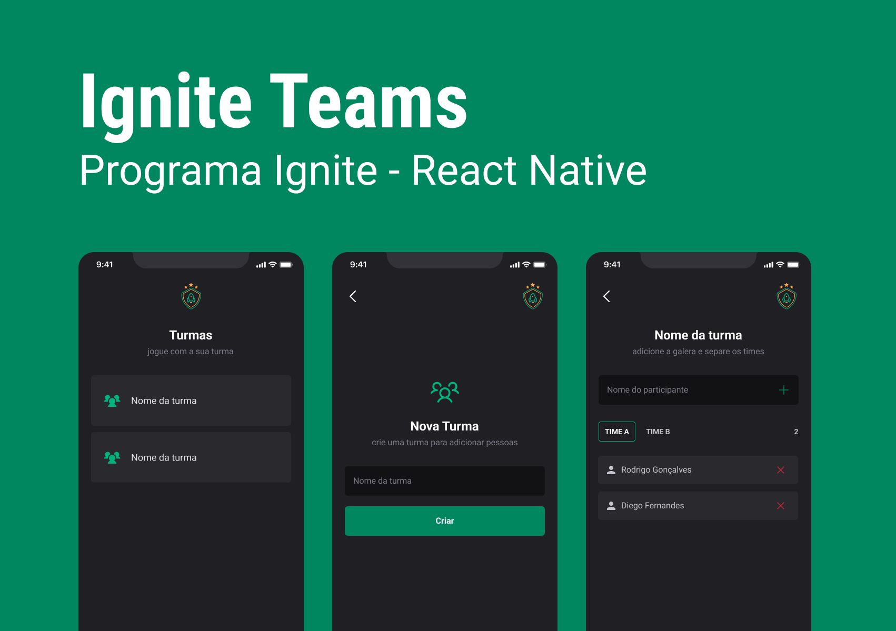

<h1 align="center"> Ignite Teams </h1>

Aplicação criada em React Native juntamente com o instrutor da RocktSeat para o módulo de Interfaces e Navegação do React Native  
<a href="https://www.figma.com/community/file/1218573349379609244">Veja o layout do projeto no Figma clicando aqui.</a>

  <a href="#-tecnologias">Tecnologias</a>&nbsp;&nbsp;&nbsp;|&nbsp;&nbsp;&nbsp;
  <a href="#-projeto">Projeto</a>&nbsp;&nbsp;&nbsp;|&nbsp;&nbsp;&nbsp;
  <a href="#-layout">Layout</a>&nbsp;&nbsp;&nbsp;|&nbsp;&nbsp;&nbsp;
  <a href="#memo-licença">Licença</a>

  

 

  

## 🚀 Tecnologias

Esse projeto foi desenvolvido com as seguintes tecnologias:

- React Native
- TypeScript
- Expo
- JavaScript
- Git e Github
- Figma
- React Native

## 💻 Projeto

O Ignite Teams é um app para adicionar a galera e criar os grupos para interação da turma, seja em time ou em conjunto. Organizar a pelada com os amigos é mais facil com esse app. Com ele é possivel adicionar grupos e cada grupo adicionar as pessoas e organiza-las em times.

- [Acesse o projeto finalizado, online](https://github.com/Tiotedd/appIgniteTeams)

## 🔖 Layout

Você pode visualizar o layout do projeto através [DESSE LINK](https://www.figma.com/community/file/1218573349379609244). É necessário ter conta no [Figma](https://figma.com) para acessá-lo.

## :memo: Licença

Esse projeto está sob a licença MIT.

---

Feito com ♥ by TioTedd :wave: [acesse meu linkedIn](https://www.linkedin.com/in/andrelsbrito/)
